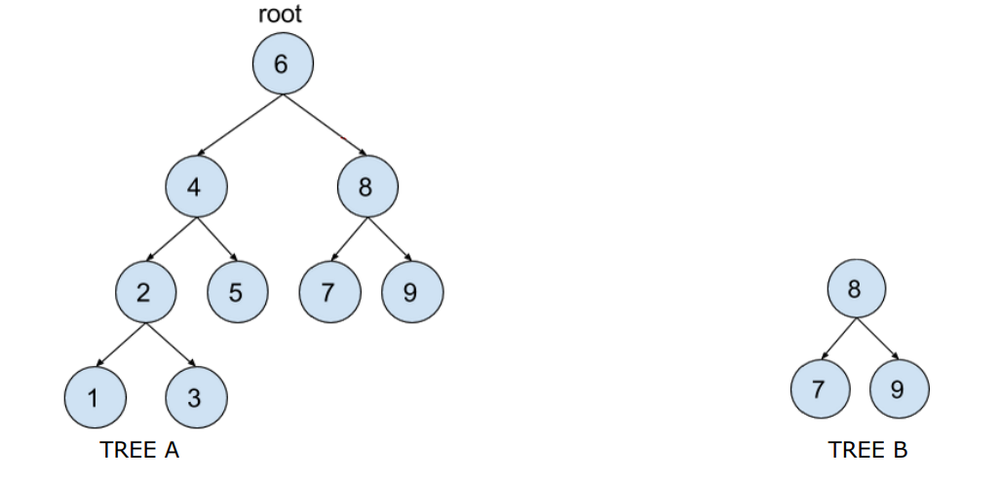

# binary-search-tree

### PROGETTO DEL CORSO DI PROGRAMMAZIONE C++

## CONSEGNA DEL PROGETTO
Il progetto consiste nella realizzazione di una classe generica che implementa
un **albero binario di ricerca**. L'albero è formato da un insieme di elementi `T`
contenuti in nodi connessi in una struttura gerarchica padre-figlio e NON deve
permettere l'inserimento di dati duplicati. Deve essere possibile per l'utente
scegliere la strategia usata per confrontare due dati `T`.

Oltre ai metodi fondamentali, la classe deve permettere:
1. Di conoscere il numero totale di dati inseriti nell'albero.
2. Il controllo di esistenza di un elemento `T`.
3. Di accedere ai dati presenti nell'albero tramite un iteratore a sola lettura
e di tipo _forward_. L'ordine con il quale sono ritornati i dati non è
rilevante.
4. Di stampare il contenuto dell'albero (anche usando `operator<<`).
5. Implementare inoltre un metodo `subtree` che, passato un dato `d` dello
stesso tipo del dato contenuto nell'albero, ritorna un nuovo albero. Il
nuovo albero deve corrispondere al sottoalbero avente come radice il
nodo con il valore `d`. Ad esempio l'esecuzione di `B=A.subtree(8)`
potrebbe corrispondere alla situazione in figura:

6. Implementare una funzione globale `printIF` che dato un albero binario di
tipo `T`, e un predicato `P`, stampa a schermo tutti i valori contenuti
nell'albero che soddisfano il predicato.

Utilizzare dove opportuno la gestione delle eccezioni. Gestite con una logica
opportuna i casi limite/di errore.

## NOTE AGGIUNTIVE DEL PROGETTO
1. Se non indicato diversamente, nella progettazione della classe, è
vietato l'uso di librerie esterne e strutture dati container della std library come
`std::vector`, `std::list` e simili. È consentito il loro uso nel codice di test nel
main.
2. A parte `nullptr`, non potete utilizzare altri costrutti C++11 e oltre.
3. Nella classe, è consentito l'uso della gerarchia di eccezioni standard,
delle asserzioni, la gerarchia degli stream e la funzione `std::swap`.
4. Per sicurezza, tutti i metodi dell'interfaccia pubblica devono essere 
esplicitamente testati nel main anche su tipi custom.
5. Usare Valgrind per testare problemi di memoria.
6. Evitate di usare "test" come nome dell'eseguibile. Potrebbe dare dei
problemi sotto msys.
